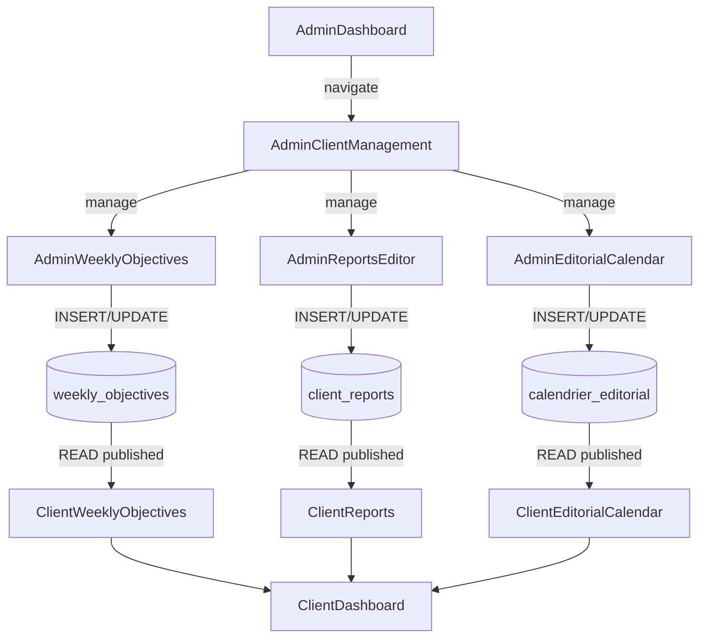

# 🚀 ARCHITECTURE COMPLÈTE: Admin Publishing → Client Display

## Vue d'ensemble du flux de publication

```
ADMIN DASHBOARD
├── Gestion des Clients
│   ├── Voir la liste des clients actifs (gauche)
│   ├── Sélectionner un client
│   └── Accéder à 4 tabs:
│       ├── Objectifs (WeeklyObjectives)
│       ├── Rapports (AdminReportsEditor)
│       ├── Calendrier (AdminEditorialCalendar)
│       └── Informations Client

CLIENT DASHBOARD
├── Voir ses Objectifs publiés (statut: pending → in_progress → achieved)
├── Télécharger ses Rapports en PDF
├── Consulter son Calendrier éditorial
└── Suivre sa progression globale
```

---

## 📁 Fichiers clés et leur rôle

### ADMIN SIDE

| Fichier | Rôle | Route |
|---------|------|-------|
| `src/pages/AdminClientManagement.tsx` | Hub central pour gérer les clients | `/admin/clients` |
| `src/components/admin/AdminWeeklyObjectives.tsx` | Créer/modifier objectives | Intégré dans AdminClientManagement |
| `src/components/admin/AdminReportsEditor.tsx` | Créer/publier rapports | Intégré dans AdminClientManagement |
| `src/components/admin/AdminEditorialCalendar.tsx` | Créer/gérer calendrier | Intégré dans AdminClientManagement |

### CLIENT SIDE

| Fichier | Rôle | Data Source |
|---------|------|-------------|
| `src/components/client/ClientWeeklyObjectives.tsx` | Affiche objectives publiées | `weekly_objectives` table |
| `src/components/client/ClientReports.tsx` | Affiche rapports publiés | `client_reports` table (is_published=true) |
| `src/components/client/ClientEditorialCalendar.tsx` | Affiche calendrier | `calendrier_editorial` table |
| `src/pages/ClientDashboard.tsx` | Navigation entre sections | Intègre tous les composants |

---

## 🔄 Workflow: Comment les données passent d'Admin à Client

### 1. ÉTAPE 1: Admin crée un Objectif
```
Admin va à: /admin/clients
1. Sélectionne un client dans la liste (gauche)
2. Clique sur l'onglet "Objectifs"
3. Remplit le formulaire:
   - Titre
   - Description
   - Semaine (week_start, week_end)
   - Statut initial (pending)
4. Clique "Créer"
→ INSERT INTO weekly_objectives (client_id, titre, week_start, week_end, status='pending')
```

### 2. ÉTAPE 2: Admin met à jour le statut (optionnel)
```
Admin peut émettre une action sur l'objectif:
- Changer statut: pending → in_progress → achieved (vert) / failed (rouge) / cancelled (gris)
→ UPDATE weekly_objectives SET status='achieved' WHERE id=?
```

### 3. ÉTAPE 3: Client voit l'objectif
```
Client va à: /clients/dashboard
1. Clique sur "Objectifs" dans le menu
2. Le composant ClientWeeklyObjectives fait:
   SELECT * FROM weekly_objectives WHERE client_id = ? ORDER BY week_start DESC
3. Affiche chaque objectif avec:
   - Couleur basée sur le statut
   - Barre de progression
   - Description
```

---

## 📊 Architecture de la Base de Données

### Table: `weekly_objectives`
```sql
Columns:
- id (UUID)
- client_id (Foreign Key)
- titre (TEXT)
- description (TEXT)
- week_start (DATE)
- week_end (DATE)
- status ('pending' | 'in_progress' | 'achieved' | 'failed' | 'cancelled')
- validated_by_admin (BOOLEAN)
- created_at (TIMESTAMP)
- updated_at (TIMESTAMP)

RLS Policy:
- Clients can SELECT their own objectives
- Admin can INSERT/UPDATE/DELETE
```

### Table: `client_reports`
```sql
Columns:
- id (UUID)
- client_id (Foreign Key)
- period_month (DATE)
- title (TEXT)
- description (TEXT)
- metrics_data (JSONB)
- is_published (BOOLEAN) ← KEY: Controls visibility
- url_pdf (TEXT, NULLABLE)
- created_at (TIMESTAMP)
- updated_at (TIMESTAMP)

Filter:
- Client sees only WHERE is_published=true
```

### Table: `calendrier_editorial`
```sql
Columns:
- id (UUID)
- client_id (Foreign Key)
- date (DATE)
- titre (TEXT)
- description (TEXT)
- categorie ('publication' | 'livraison' | 'reunion' | 'autre')
- statut ('planifie' | 'en_cours' | 'termine' | 'annule')
- created_at (TIMESTAMP)
- updated_at (TIMESTAMP)
```

---

## 🎯 Checklist d'implémentation

### ✅ Backend (Supabase)
- [x] Tables créées avec migrations
- [x] RLS policies en place
- [x] Indexes pour performance
- [ ] **Besoin d'ajout:** Meilleure colonne de contrôle de visibilité sur `calendrier_editorial`

### ✅ Admin Components
- [x] AdminClientManagement (hub central)
- [x] AdminWeeklyObjectives.tsx (créer/modifier objectives)
- [x] AdminReportsEditor.tsx (créer/publier rapports)
- [x] AdminEditorialCalendar.tsx (créer/gérer calendrier)

### 🟡 Client Components (À vérifier/améliorer)
- [ ] ClientWeeklyObjectives.tsx - Affiche les objectives publiées
- [ ] ClientReports.tsx - Affiche les rapports (is_published=true)
- [ ] ClientEditorialCalendar.tsx - Affiche le calendrier
- [ ] PDF Export - À implémenter

---

## 🔐 Model de Contrôle d'Accès

### Pour les Objectifs
```typescript
Admin POV:
- Voir TOUS les objectifs (pour tous les clients)
- Créer/modifier/supprimer les objectifs
- Changer le statut

Client POV:
- Voir ses PROPRES objectifs
- Voir le statut
- Voir la progression
- NE PAS POUVOIR les modifier
```

### Pour les Rapports
```typescript
Admin POV:
- Créer/modifier les rapports
- Contrôler la visibilité via is_published
- Ajouter les métriques

Client POV:
- Voir seulement les rapports où is_published=true
- Télécharger en PDF (à implémenter)
```

---

## 💡 Améliorations Future

### À Court Terme (Essentielles)
1. **PDF Export**
   - Rapports: `html2pdf` ou `jsPDF`
   - Calendrier: même lib
   
2. **Better Status UI**
   - Ajouter des icônes distinctes pour chaque statut
   - Animations pour les changements de statut

3. **Notifications**
   - Notifier le client quand un nouvel objectif est créé
   - Notifier quand un rapport est publié

### À Moyen Terme (UX)
1. **Progress Auto-Calculation**
   - Calculer automatiquement: (achieved / total) × 100
   - Afficher la tendance (↑ progress vs last week)

2. **Admin Approval Workflow**
   - Admin crée → Client voit "En attente d'approbation"
   - Admin valide → Client voit "Approuvé"

3. **Calendar Visibility Toggle**
   - Ajouter colonne `is_visible` ou `statut`
   - Admin détermine qui voit quoi et quand

---

## 🚀 Prochaines Étapes

1. **Créer AdminDashboard Route**
   ```typescript
   // src/App.tsx
   {authenticated && userRole === 'admin' && (
     <Route path="/admin/clients" element={<AdminClientManagement />} />
   )}
   ```

2. **Ajouter Link dans AdminDashboard**
   ```typescript
   // Dans AdminDashboard.tsx
   <button onClick={() => navigate('/admin/clients')}>
     Gérer Clients & Contenu
   </button>
   ```

3. **Tester le Flow Complet**
   - Admin: Créer un client de test
   - Admin: Ajouter objectif
   - Client: Se connecter et voir l'objectif

4. **Ajouter PDF Export**
   ```bash
   npm install html2pdf.js
   ```

---

## 📱 Mobile Responsiveness

Tous les composants utilisent:
- `grid-cols-1 md:grid-cols-2 lg:grid-cols-3`
- `flex-col sm:flex-row`
- Breakpoints Tailwind standards

La page `AdminClientManagement` a un layout:
- **Mobile:** Client list en haut, contenu en bas
- **Tablet+:** 2 colonnes (list | content)

---

## 🔗 Relations et Dépendances



---

## ✅ Validation

Avant de considérer comme "fini":
- [ ] Admin peut créer un client
- [ ] Admin peut ajouter un objectif au client
- [ ] Client voit l'objectif dans son dashboard
- [ ] Admin peut changer le statut
- [ ] Client voit la couleur changer en temps réel
- [ ] Admin peut créer/publier un rapport
- [ ] Client voit le rapport
- [ ] Admin peut créer un événement calendrier
- [ ] Client voit l'événement

---

**Auteur:** Architecture mise à jour pour flux publication complet  
**Date:** Janvier 2025  
**Version:** 1.0
